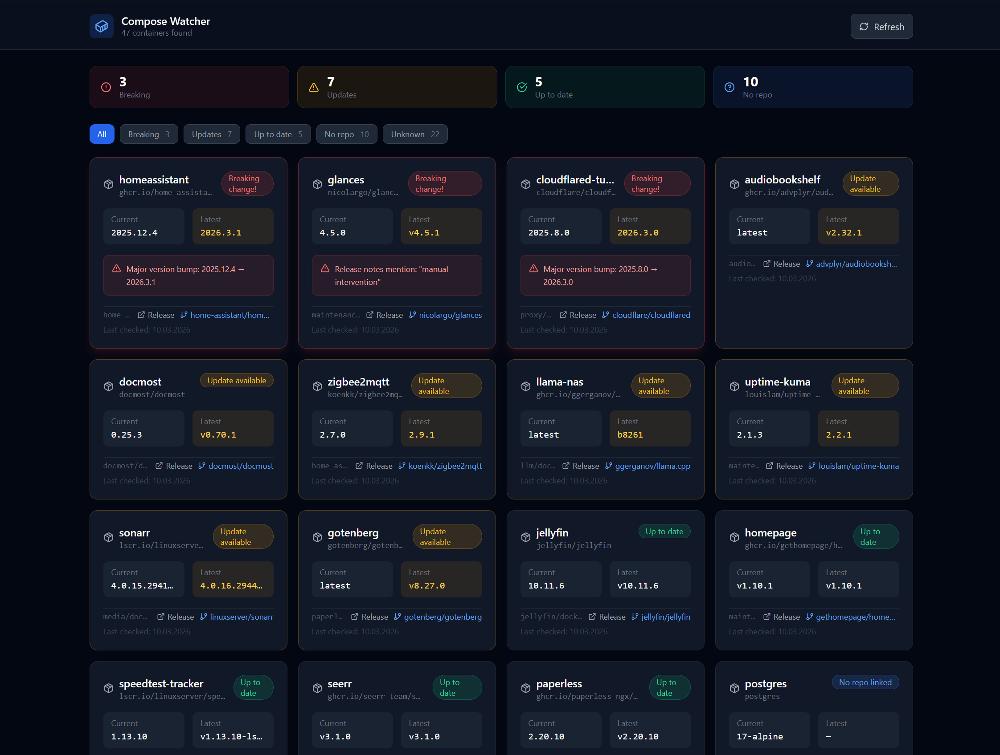

# ComposeWatcher

A self-hosted web dashboard that scans your Docker Compose files, compares running container image tags against GitHub releases, and highlights available updates — including breaking changes.


[](https://ko-fi.com/K3K01VQRQJ)

## Features

- Automatically scans a directory of Docker Compose files for container images
- Compares current image tags against latest GitHub releases using semantic versioning
- Detects **breaking changes** (major version bumps, keywords like "breaking change", "migration required" in release notes)
- Filter containers by status: up-to-date, update available, breaking change, unknown
- Persistent repository mappings stored in a JSON config file



## Status Values

| Status | Description |
|---|---|
| `up-to-date` | Current tag matches latest release |
| `update-available` | Newer release exists (minor/patch) |
| `breaking-change` | Major version bump or breaking change detected in release notes |
| `unknown` | Could not determine status (e.g. non-semver tags) |
| `no-repo` | No GitHub repository linked yet |

## Getting Started

### Prerequisites

- Docker & Docker Compose

### Setup

1. Clone the repository:
   ```bash
   git clone https://github.com/your-username/ComposeWatcher.git
   cd ComposeWatcher
   ```

2. Edit `docker-compose.yml` and set the volume path to your Docker Compose directory:
   ```yaml
   volumes:
     - /your/docker/folder:/docker:ro   # <-- Change this
   ```

3. Start the stack:
   ```bash
   docker compose up -d
   ```

4. Open [http://localhost:8555](http://localhost:8555)

## Environment Variables (Backend)

| Variable | Default | Description |
|---|---|---|
| `DOCKER_DIR` | `/docker` | Path to the directory containing Docker Compose files |
| `DATA_DIR` | `/data` | Path for the persistent config JSON |
| `PORT` | `3000` | Backend server port |
| `GITHUB_TOKEN` | _(none)_ | GitHub personal access token — raises API rate limit from 60 to 5 000 req/hour |

### GitHub API Rate Limits

Without a token, GitHub's API allows only **60 requests per hour per IP address**. Each container with a linked repository consumes one request on every refresh. If you have many containers or click Refresh frequently, requests will start failing silently and affected containers will show status `unknown`.

**Setting a token is strongly recommended for any real-world deployment.**

To create a token: GitHub → Settings → Developer Settings → Personal access tokens → Fine-grained tokens. No specific scopes are required for public repositories.

```yaml
# docker-compose.yml
environment:
  - GITHUB_TOKEN=ghp_your_token_here
```

## API Endpoints

| Method | Endpoint | Description |
|---|---|---|
| `GET` | `/api/containers` | Returns all containers with update status |
| `GET` | `/api/containers?refresh=true` | Bypasses cache and fetches fresh data |
| `POST` | `/api/containers/:id/repo` | Link or unlink a GitHub repo (`{ repo: "owner/repo" \| null }`) |
| `GET` | `/api/config` | Returns current repository mappings |

## How It Works

1. The backend scans all `docker-compose*.yml` files in the configured `DOCKER_DIR`
2. For each container image, it attempts to infer the GitHub repository from the image name
3. If a repo is linked, it fetches the latest releases from the GitHub API
4. The current image tag is compared against the latest release using semver
5. Release notes are scanned for breaking change indicators
6. Results are cached for 5 minutes and served to the frontend

## Persistent Storage

Repository mappings are stored in a Docker volume at `/data/config.json`. This persists across container restarts.

## License

MIT
